<div align="center">

#  ZION

### Built for a startup. Engineered from scratch.

*A production-ready cab booking app — OTP auth, real-time driver matching, live tracking, and a fully serverless backend.*

[](https://flutter.dev)
[](https://firebase.google.com)
[](https://dart.dev)
[](https://developers.google.com/maps)

</div>

---

## 📌 Table of Contents

- [Intro](#intro)
- [Features](#features)
- [Tech Stack](#tech-stack)
- [Screenshots](#screenshots)
- [Architecture](#architecture)
- [Key Implementation Highlights](#highlights)
- [Roadmap](#roadmap)

---

<a id="intro"></a>
## 🧠 Intro

**ZION** is a production-grade cab booking platform I designed and engineered end-to-end for a startup — spanning Figma UI/UX design, Flutter frontend development, and a fully serverless Firebase backend orchestrated through Cloud Functions.

The app covers the entire ride lifecycle without compromise: phone-based OTP authentication, intelligent destination search powered by Google Places Autocomplete, geo-query-based nearby driver discovery using Firestore, server-side fare calculation, vehicle selection with upfront pricing, real-time driver location tracking on a custom-styled map, in-app chat between rider and driver, turn-by-turn navigation routing, and seamless ride state recovery — even if the app is force-quit and relaunched mid-trip, every detail of the active ride is restored instantly from Firestore.

This repo contains the **Rider App** (user-facing). Driver App and Admin Panel are in different repo.

---

<a id="features"></a>

## ✨ Features

- **OTP Phone Authentication** — Passwordless, secure sign-in using Firebase Auth SMS verification. Users enter their phone number, receive a one-time code, complete their profile once, and are never asked to log in again.

- **Google Places Autocomplete** — As the user types a destination, the Google Places API surfaces intelligent, ranked address suggestions in real time — including support for landmark names, partial addresses, and recent locations.

- **Geo-Query Driver Discovery** — Nearby available drivers are fetched live from Firestore using geo-hash radius queries via `geoflutterfire_plus`. The rider sees real-time availability without any manual refresh.

- **Vehicle Selection with Upfront Pricing** — Riders choose between Zion Auto (3 seats) and Zion Car (4 seats), both displaying a fare calculated server-side before the booking is confirmed — no surprises at the end.

- **Live Driver Tracking** — Once a ride is confirmed, the driver's location updates continuously on the map with a smooth animated marker, giving the rider an accurate, live view of arrival progress.

- **In-App Ride Chat** — Riders and drivers can message each other directly inside the app during an active ride — no need to share phone numbers or switch to external apps.

- **Ride PIN Verification** — A unique 4-digit PIN is generated per ride and shown to the rider. The driver must confirm it at pickup, preventing wrong pickups and adding a layer of safety.

- **Driver Rating & Feedback** — After every completed trip, riders can rate their driver and leave feedback, feeding into the driver's overall rating displayed on future rides.

- **Ride Cancellation Flow** — Riders can cancel an active ride with structured reason selection. Cancellation triggers a full Firestore state cleanup and notifies the driver in real time via FCM.

- **Persistent Ride State** — If the app is closed or removed from RAM during an active trip, relaunching it automatically detects the ongoing ride and restores all details — driver info, PIN, route, and current status — exactly as it was.

- **Past Trips** — A complete ride history view with per-trip breakdown: route taken, driver, vehicle, fare, date, and trip duration.

- **Push Notifications** — Firebase Cloud Messaging delivers real-time ride status updates (driver assigned, driver arriving, ride started, ride completed) even when the app is in the background.

- **Dark & Light Mode** — The entire app, including Google Maps styling, adapts to the system theme with fully designed dark and light variants.

- **Crash Reporting** — Firebase Crashlytics captures and reports runtime errors in production, with stack traces and device context for fast debugging.

---

<a id="tech-stack"></a>
## 🛠️ Tech Stack

| Layer | Technology |
|---|---|
| **Framework** | Flutter 3.x |
| **State Management** | Riverpod 2.x |
| **Authentication** | Firebase Auth (Phone OTP) |
| **Database** | Cloud Firestore |
| **Backend Logic** | Firebase Cloud Functions (Node.js / TypeScript) |
| **Maps & Navigation** | Google Maps Flutter, Polyline Points |
| **Location Services** | Geolocator, GeoFlutterFire+ |
| **Place Search** | Google Places Autocomplete API |
| **Push Notifications** | Firebase Cloud Messaging |
| **File Storage** | Firebase Storage |
| **Crash Monitoring** | Firebase Crashlytics |
| **Security** | Firebase App Check |
| **UI** | flutter_screenutil, Google Fonts, shimmer, animated_text_kit |

---

<a id="screenshots"></a>
## 📱 Screenshots

<div align="center">

> 📂 View all screenshots &nbsp;·&nbsp; [`🌙 Dark`](assets/screenshots/dark/) &nbsp;·&nbsp; [`☀️ Light`](assets/screenshots/light/)

<br/>

**🌙 Dark Mode**

<br/>

&emsp;&emsp;&emsp;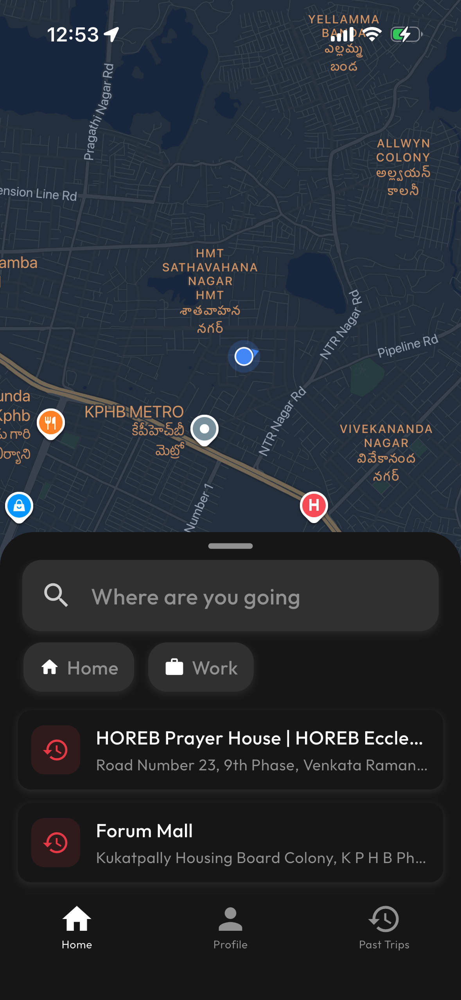&emsp;&emsp;&emsp;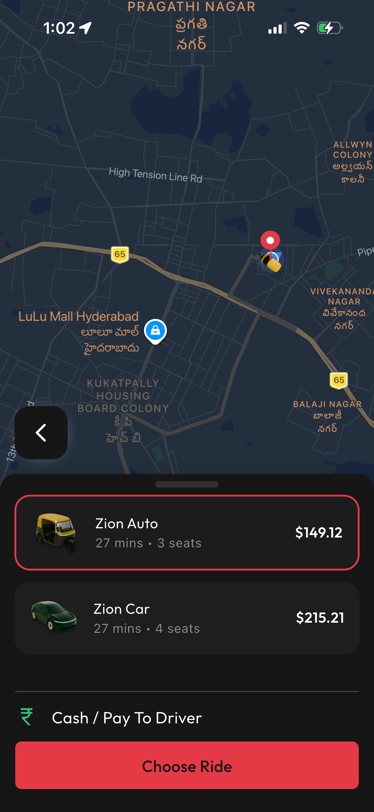

<br/><br/><br/>

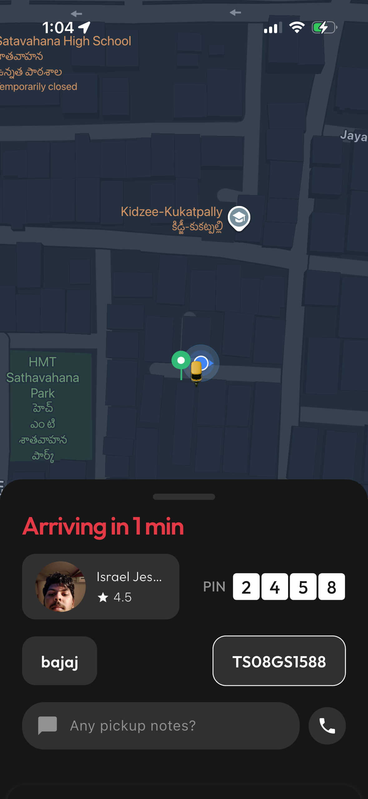&emsp;&emsp;&emsp;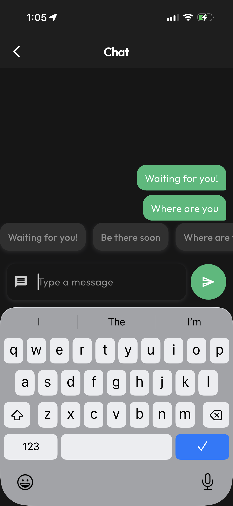&emsp;&emsp;&emsp;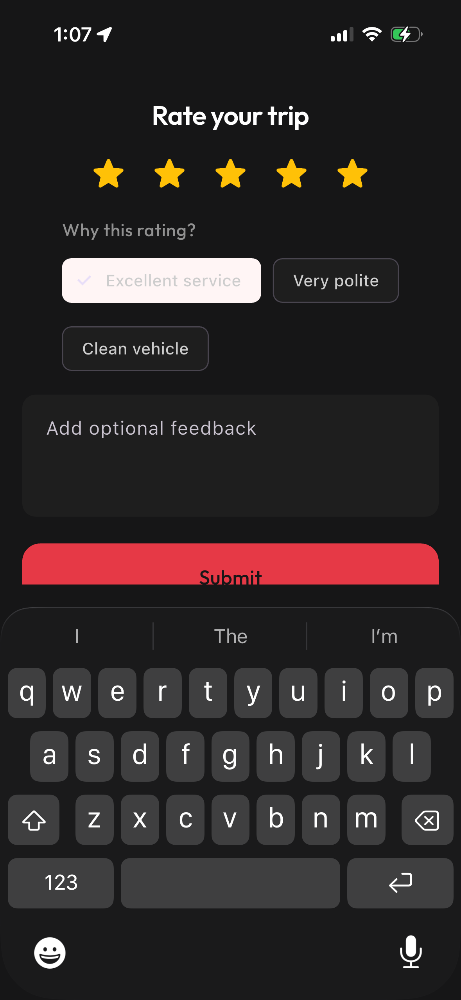

<br/><br/><br/>

**☀️ Light Mode**

<br/>

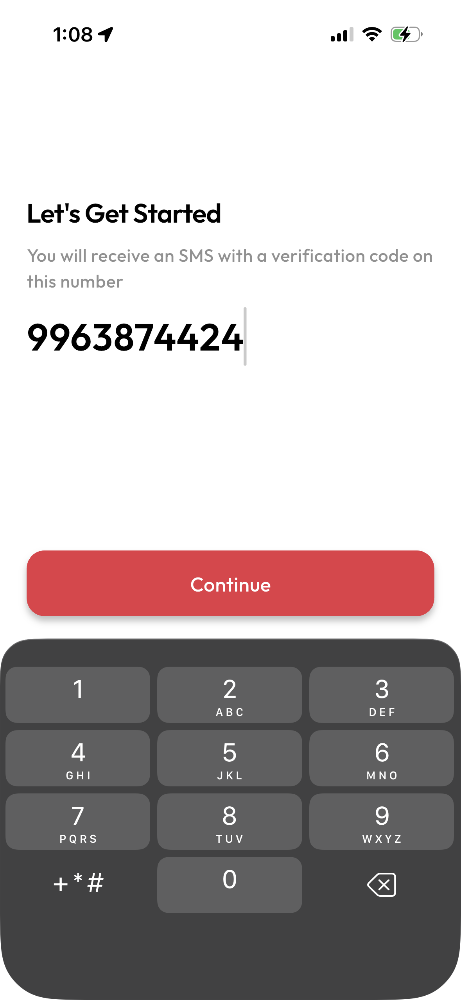&emsp;&emsp;&emsp;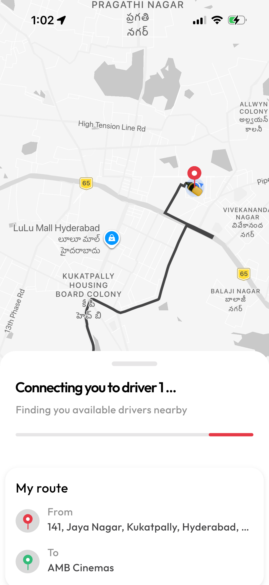&emsp;&emsp;&emsp;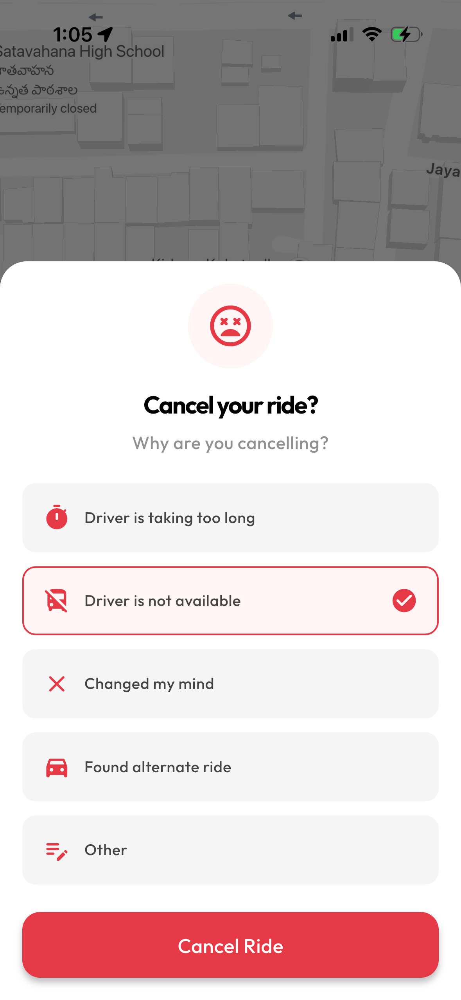

<br/><br/><br/>

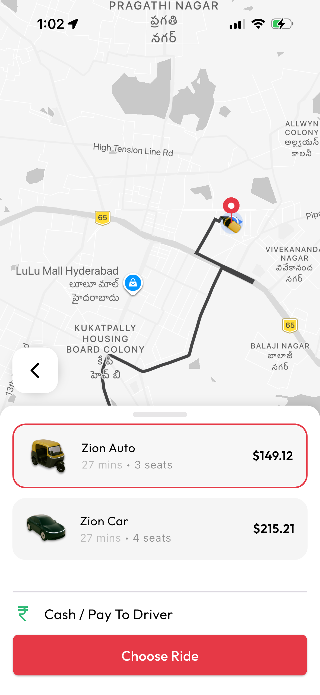&emsp;&emsp;&emsp;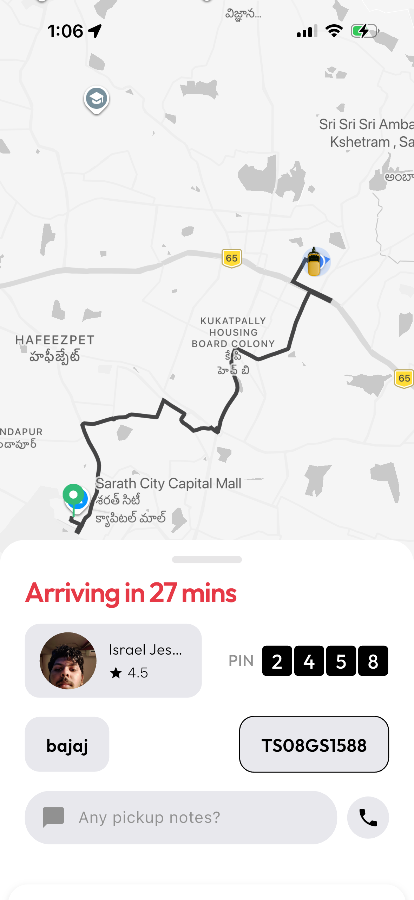&emsp;&emsp;&emsp;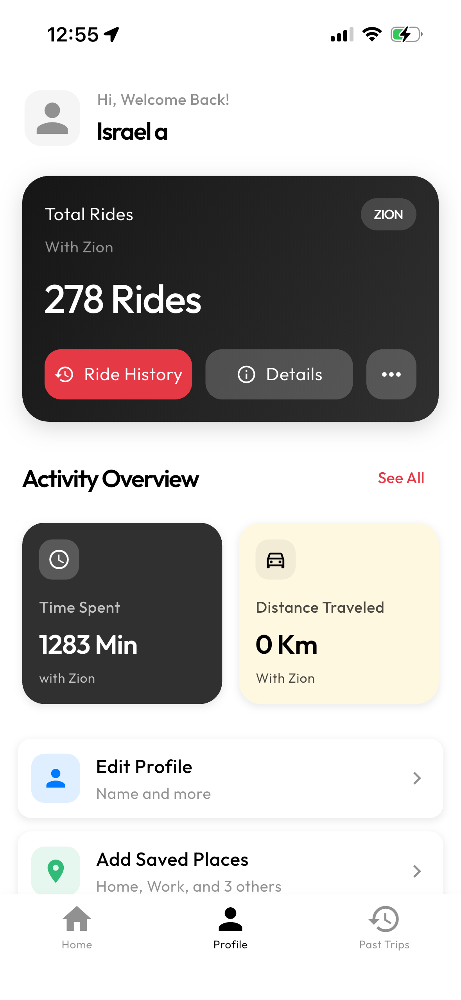

</div>

---

<a id="architecture"></a>
## 🏗️ Architecture

ZION uses a **feature-first, W&F (Work & Function) architecture** — every feature lives in its own self-contained folder with a strict 3-file pattern.

```
lib/
└── pages/
    └── RIDE_W&F/                  ← one folder per feature
        ├── screen_Ride.dart       # UI only — no logic here
        ├── controller_Ride.dart   # Firebase calls, business rules
        └── provider_Ride.dart     # Riverpod state providers
```

Features follow this same pattern across the entire app:

```
pages/
├── HOMEPAGE_W&F/
├── LOGIN_W&F/
├── LANDINGPAGE_W&F/
├── RIDE_W&F/
├── PRICE_PAGE_W&F/
├── START_DEST_W&F/
├── PROFILE_W&F/
└── RECENT_RIDES_W&F/
```

Sensitive backend logic lives in **Cloud Functions**, completely off the client:

```
functions/src/
├── fareCalculation.ts   # Server-side pricing engine
├── assignDriver.ts      # Driver matching logic
├── tripLifecycle.ts     # Ride state machine
└── notifications.ts     # FCM push triggers
```

---

<a id="highlights"></a>
## 📐 Key Implementation Highlights

**Persistent Ride State Recovery**
If the app is killed mid-trip and relaunched, it detects the active ride on startup and silently restores the full session from Firestore — driver details, PIN, live route, and current status — dropping the rider back in exactly where they left off. No re-booking, no lost context.

**Real-Time Driver Discovery via Firestore Geo-Queries**
Driver locations are continuously written to Firestore with geo-hash indexing. `geoflutterfire_plus` runs live radius-based queries that stream nearby available drivers in real time — no polling, no manual refresh. When availability changes, the UI reacts instantly.

**Trip Lifecycle State Machine**
The entire ride flow — request, driver assigned, en route, arrived, in-trip, completed, cancelled — is managed as a strict state machine through Cloud Functions and Firestore listeners. Each state transition is atomic, preventing invalid states like a ride being both active and cancelled simultaneously.

**In-App Chat During Active Rides**
A dedicated real-time messaging channel between rider and driver is opened per trip using Firestore document streams. Messages land instantly on both ends — no third-party service, no phone number exposure, no delay.

**Riverpod-Driven Feature Architecture**
Every W&F module owns its async state through dedicated Riverpod providers. Screens are purely declarative — they observe, never act. All Firebase calls, side effects, and business logic live exclusively in controllers, making every feature independently testable and the codebase built to scale.

**Custom Map Theming & Live Route Rendering**
Google Maps runs on custom JSON style configs that swap dynamically with the app theme — no flicker, no mismatch. Pickup-to-drop routes are computed via the Directions API and rendered as smooth polylines using `flutter_polyline_points`, with the driver's live position tracked by a custom animated SVG marker.

**Server-Side Fare Calculation**
Fares are computed inside Firebase Cloud Functions before the rider ever sees a price — distance, vehicle type, all of it resolved server-side. The client receives a number. It cannot negotiate, manipulate, or guess how it was made.

---

<a id="roadmap"></a>
## 🗺️ Roadmap

- [x] Rider App — this repo
- [ ] Driver App — accept/reject rides, live navigation to pickup & drop
- [ ] Admin Panel — fleet management, analytics, surge pricing controls

---

## 👤 Author

**a.israel** — designed, built, and shipped solo. Figma → Flutter → Firebase Cloud Functions.

[](https://github.com/izzy3443)

---

<div align="center">
  <sub>· Flutter + Firebase · 2025</sub>
</div>

